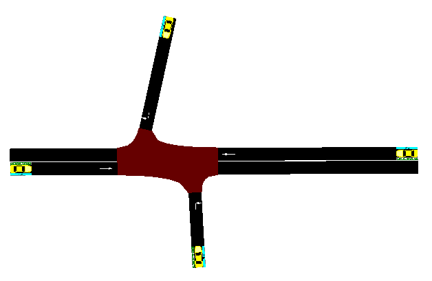
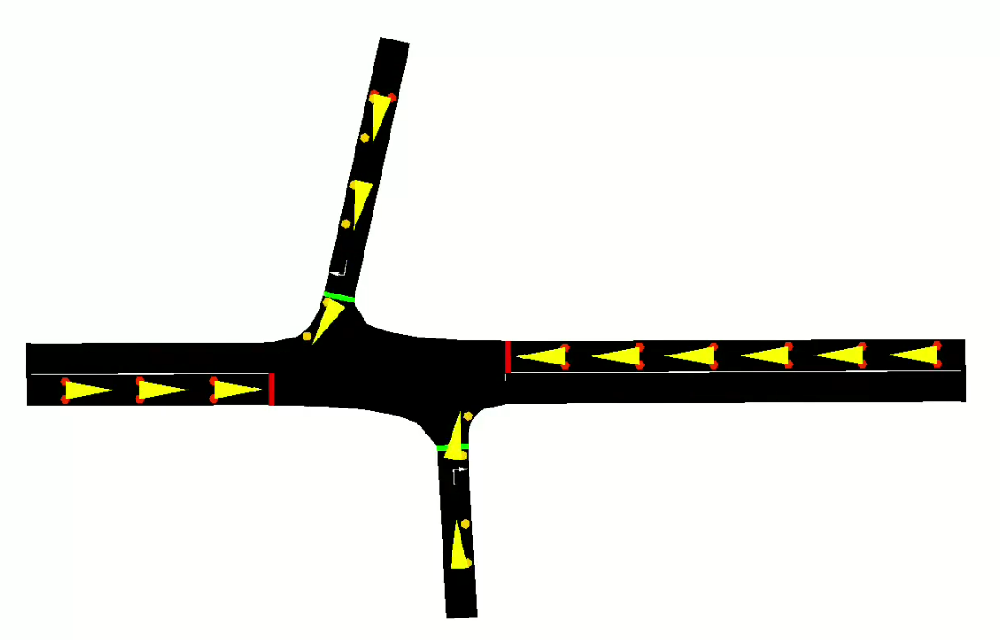

# AI-TrafficControl

This project is a simple yet effective demonstration of using reinforcement learning (specifically Q-learning) to optimize traffic light timings. It integrates with SUMO (Simulation of Urban Mobility) to simulate traffic scenarios, enabling us to train and test a Q-learning agent to improve traffic flow.

## Motivation

We’ve all been stuck at a red light, watching an empty intersection while traffic builds up behind us. It’s frustrating and wastes time, fuel, and energy. That got us thinking—what if traffic lights could get smarter? Instead of following the same fixed patterns, they could adjust based on actual traffic conditions.

This project is our attempt to tackle that problem using AI. By teaching a program to manage traffic lights in a way that reduces waiting times and keeps things moving smoothly, we hope to show how technology can make everyday life better. It’s a simple idea with a big impact: fewer traffic jams, less stress, and more time for the things that matter.

## How the Project Works

#### Step 1: Setting Things Up
We design a virtual traffic intersection with SUMO, a traffic simulation tool, using files to set up the roads (intersection.net.xml) and routes (intersection.rou.xml).
Then we connect SUMO to Python using a library called traci so our code can control the traffic lights.

#### Step 2: Creating the Agent
We build an agent that makes decisions on how to manage traffic lights.
It learns what’s happening on the road (traffic states), figures out its options (actions), and gets feedback (rewards) on whether its choices helped or made traffic worse.

#### Step 3: Running the Simulation
The environment (env.py) runs the traffic simulation, showing what’s happening at the intersection in real time.
The agent makes decisions based on this information and tries to improve traffic flow.

#### Step 4: Training the Agent
We use the train.py script to teach the agent over many rounds of simulation.
It keeps getting better at making decisions by learning from its successes and mistakes.

#### Step 5: Testing the Agent
Once the agent is trained, we run the test.py script to see how well it handles traffic in the network.

#### Step 6: Checking the Results
Finally, we see how much the agent improves traffic compared to regular timed traffic lights.
If it’s not perfect, we can tweak some settings (like how quickly it learns or explores new ideas) to make it even better.


<h1 style="font-size: 24px;">Agent</h1>

#### Overview of Q-Learning Agent
This file contains the Q-learning agent, which is designed to control traffic lights. The agent's goal is to learn the best traffic light control policy using reinforcement learning, so it can minimize traffic congestion and improve traffic flow over time.

To do this, the agent uses a Q-table—a data structure that stores information about how good different actions are in different states of the traffic system.

#### How the Q-Table Works
Think of the Q-table as a large table where:
Rows represent states (e.g., current traffic conditions, current traffic light phases).
Columns represent actions (e.g., which traffic light phase to switch to, or whether to keep the current phase).
Each cell in the table contains a Q-value, which tells the agent how good it is to take a specific action in a particular state.
The idea is that the agent will learn over time which actions (traffic light phases) lead to the best results (reducing wait times for cars stuck in traffic/signal). In this problem we have continuous state space rather than discrete. So Q-table is updated when agent explores a new state. Initially Q-table is empty.

<h3> Key Functions in the Agent </h3>

**Initialization functions** 
These are the helper functions which intialize an empty Q-table, creates action space and sets the initial state for the enviornment. 

**Action Space**\
Action space is discrete which is based on the network we made. For example we have 4 lanes then following will be the actions:
<ol>
  <li>GrGr</li>
  <li>yryr</li>
  <li>rGrG</li>
  <li>ryry</li>
</ol>

<div style="text-align: center;">
  
</div>


**choose_action**\
This function decides which action (traffic light change) the agent should take in a given state. It does this using the epsilon-greedy strategy.
Exploration: Sometimes the agent will choose a random action. This is the agent’s way of exploring new actions, even if it doesn’t know if they’re good or bad yet.
Exploitation: Other times, the agent will choose the action with the highest Q-value for the current state. This is called exploitation—basically, the agent is playing it safe by sticking with the best-known action.
The agent needs to balance exploration (to discover new things) and exploitation (to make the best use of what it’s already learned). The epsilon value controls how often the agent explores versus exploits.

**learn**\
This function is where the Q-learning happens. It updates the Q-values in the Q-table based on feedback from the environment. The formula used is:

`Q(state, action) = Q(state, action) + alpha * (reward + gamma * max(Q(next_state, :)) - Q(state, action))`

alpha: This is the learning rate. It controls how quickly the agent learns from new experiences. If alpha is too small, the agent will learn slowly; if it’s too big, it might learn too quickly and forget what it has learned.\
gamma: This is the discount factor. It controls how much the agent cares about future rewards. If gamma is close to 0, the agent focuses mostly on immediate rewards. If gamma is close to 1, the agent thinks more about long-term rewards.\
reward: This is feedback from the environment that tells the agent how good or bad its action was (e.g., reducing wait time).\
max(Q(next_state, :)): This looks at the best possible future Q-value for the next state, which helps the agent predict the long-term reward.\
This function updates the Q-values over time, helping the agent get better at making decisions. The more experiences it has, the better it gets at choosing actions that lead to higher rewards.\
**Training Flow**
Here’s how the agent trains:
The agent observes the current state (traffic conditions).
It chooses an action (change the traffic light).
It receives a reward (improved traffic flow) and observes the next state (updated traffic conditions).
The agent updates the Q-value for the action it took, based on the reward and the potential future rewards.
Through this process, the agent gradually learns the best actions to take in different states.\
**Testing Mode**
In testing mode, the agent switches from learning (exploring) to just using what it has already learned. This means:
The agent only exploits the best-known policies and doesn't explore new actions.
It evaluates how well the learned policy performs in real traffic scenarios.

<h1 style="font-size: 24px;">Env</h1>
This file defines the interaction between the reinforcement learning agent and the SUMO traffic environment.

#### How States Are Extracted
A state combines:
Current traffic light phase (GrGr, yryr, rGrG, ryry). G= Green, r=red, y=yellow. 4 lanes means 4 different combinations.
Traffic density on incoming lanes (e.g., number of cars waiting at each lane). We've divided this into "low", "medium' and "high" traffic
Our total number of states is the total number of unique states the environment can have, based on the possible traffic flow levels for each lane and the number of traffic light phases. The calculation accounts for every combination of traffic flow across all lanes and each traffic light phase.

#### Reward Calculation
Rewards are designed to encourage smoother traffic flow:

Positive reward: Given when traffic congestion decreases after an action.
Negative reward: Given when congestion increases or no improvement is observed.

**Reward Logic**
It compares the current traffic flow to the previous state and adjusts the reward accordingly:

State Mapping: Traffic flow levels (low, medium, high) are mapped to numbers (0, 1, 2) for easy comparison.

Increased flow (more congestion) implies Penalty (higher penalties for higher traffic).
Decreased flow (less congestion) implies Reward (larger rewards for lower traffic).
No change implies A small reward for "low" traffic and a small penalty for "medium" or "high" traffic.
Invalid Traffic Light Phases: If the traffic light phase is invalid (not one of the predefined phases), a penalty is applied.

This function is designed to encourage smoother traffic by rewarding reduced congestion and penalizing increased congestion.


<h3> Key Functions </h3>

**get_state**
The get_state function gathers the current state of the traffic from sumo, including the traffic light phase and the flow of vehicles in each lane. It works as follows:
- **Traffic Light Phase**:  
  - Retrieve the current traffic light phase (e.g., Green, Yellow, Red) from the SUMO simulation using the `traci` API.

- **Vehicle Data**:  
  - Collect a list of vehicles currently in the simulation.  
  - Check each vehicle's position (lane) and accumulated waiting time (how long they’ve been waiting).

- **Traffic Flow Calculation**:  
  - Assign each vehicle to one of the four lanes: top-right, bottom-left, top, or bottom.  
  - Count the number of vehicles in each lane.  
  - Track the accumulated waiting time for vehicles in each lane.

- **Traffic Flow Classification**:  
  - If the accumulated waiting time in a lane is more than 50 seconds, classify the traffic flow as **"high"**.  
  - If the accumulated waiting time is between 20 and 50 seconds, classify the traffic flow as **"medium"**.  
  - If the accumulated waiting time is less than 20 seconds, classify the traffic flow as **"low"**.


This function helps track the environment's state, allowing the agent to make decisions based on real-time traffic conditions.

**perform_action**
Executes the chosen action in SUMO by changing the traffic light phase.

**reset** 
Resets the simulation environment for a new training/testing epoch.

<h1 style="font-size: 24px;">Setup</h1>

To install the required Python packages and download SUMO, follow these steps:

1. **Install Packages from `requirements.txt`**:
   ```bash
   pip install -r requirements.txt
2. **Download Sumo**:
    - Visit the [SUMO official website](https://sumo.dlr.de/docs/Downloads.php) to download the latest version.

        - Follow the installation instructions specific to your operating system
3. **Export Sumo Tools Path**
    - Windows: Add sumo path using the enviorment variable settings.
    - Mac/Linux: Run the following command to add sumo path.
        ```bash
        export PYTHONPATH="path/python3.10/site-packages/sumo/tools:$PYTHONPATH
4. Verify sumo installation 
    ```bash 
    sumo --version
5. Set sumo path in train and test.py
    - Based on your virtual environment path update the below for the following line:
        ```Python
        traci.start(["venv/bin/sumo-gui", "-n", "intersection.net.xml","-r", "intersection.rou.xml", "--start"])  # Use sumo-gui for GUI mode
If there is any  issue  during installation and running the program, please reach out. If there is any issue most likely it will be because of Sumo.

<h1 style="font-size: 24px;">Train</h1>
This file trains a Q-learning agent to optimize traffic flow in a simulation environment.

**Training Process**

Initialize Agent: A Q-learning agent is created and initialized.

Epsilon Decay: The exploration-exploitation balance (epsilon) decays over time, encouraging the agent to exploit its knowledge as training progresses.

Simulation Steps: The agent interacts with the simulation by taking actions based on its current state, learning from the rewards and adjusting its Q-values accordingly.

Epochs: The training runs for multiple epochs, where the agent gradually improves its performance.

**How to Run**

In order to run the code, use the following command. By default it will use CLI mode for sumo
    

    python train.py
If you want to run it in GUI mode then add the following command:

    python train.py --gui=true

Click the Image below to watch a short video

[](https://drive.google.com/file/d/1yXx80XOR9vG09wPnh2W_t1vo_5_yQBH4/view?usp=sharing)

<h1 style="font-size: 24px;">Test</h1>
This file evaluates the performance of a trained Q-learning agent in a traffic simulation.

**Testing Process**
Load Q-table: The trained Q-table is loaded from a .npy file.
Run Simulation: The agent uses the Q-table to make decisions.

**How to Run**

In order to run the code, use the following command:
    

    python test.py

Click the Image below to watch a short video

[](https://drive.google.com/file/d/1VfQgDuK-0ie7cF29t-CVbPnMYh3ZGre5/view?usp=sharing)

**Performance Metrics**:
Actions chosen for each state.
Total rewards earned.
Traffic efficiency improvements (e.g., reduced waiting times, smoother flow). 

<h1 style="font-size: 24px;">Intersection xml</h1>

These files define the traffic network and routes for SUMO:

intersection.net.xml: Describes the road network, including lanes, traffic lights, and connections.
intersection.rou.xml: Specifies vehicle routes, spawn times, and destinations to simulate realistic traffic.

## What we accomplished

We achieved everything we set out to do:
- Successfully built a simulation of a traffic intersection.
- Trained a smart traffic light controller using Q-learning.
- Improved traffic flow compared to traditional timed lights.
- Tested the trained agent in different scenarios, showing great results.

## How we measured our success

- Compared simulations without an agent and with an agent- the difference could be clearly seen
- Measured accumulated reward during the training process


